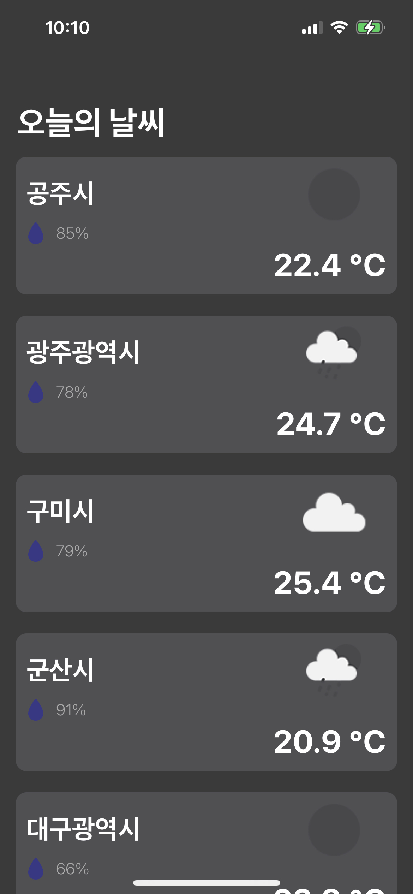

# 원티드 프리온보딩 iOS 과정
### 과제 사항
- Open Weather API를 활용하여 다음을 충족하는 앱을 구현하라.
- 첫번째 화면
    - 아래 각 도시의 현재 날씨를 화면에 표시합니다.
        - 필수로 포함해야 하는 정보
            - 도시이름, 날씨 아이콘, 현재기온, 현재습도
                
                > 공주, 광주(전라남도), 구미, 군산, 대구, 대전, 목포, 부산, 서산, 서울, 속초, 수원, 순천, 울산, 익산, 전주, 제주시, 천안, 청주, 춘천
                > 
            - 날씨 아이콘의 경우 API에서 제공하는 아이콘을 활용합니다.

